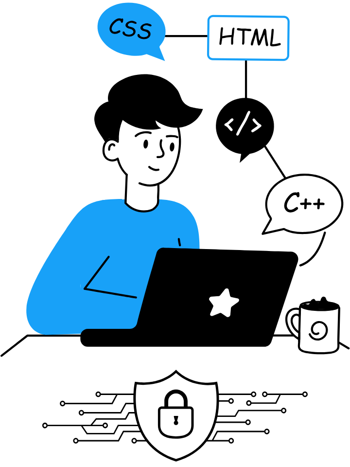

# Hi 👋, I'm [Safal Lama](https://safallama.com.np), aka [Happilli](https://github.com/happilli)!

  
  
    "I love to code by day, when night falls I save society, <i>I am Batman.</i>"
  

## GitHub Profile Overview

## Connect with Me

  
  
  
  
  

